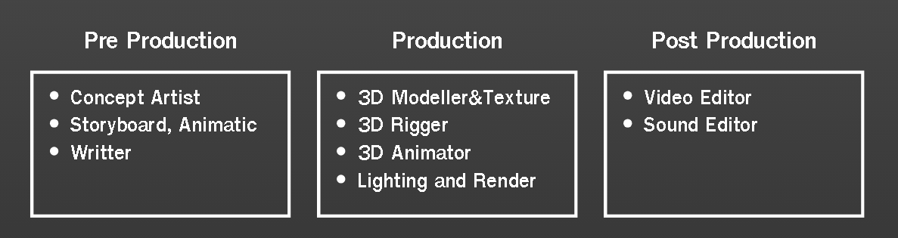

# Introduction

นี่คือ Website Ukore In House ซึ่งจะรวบรวมข้อมูลทุกอย่างที่ Artist ต้องรู้เพื่อปรับตัวกับการทำงานภายในองค์กรได้อย่างราบรื่น

โดยงานเราจะแบ่งออกเป็น 3 แผนกใหญ่ๆ ได้แก่ Pre-Production , Production และ Post-Production

โดยคุณสามารถเข้าไปอ่าน Guide ของแต่ละแผนกได้เลยดังนี้

- [Pre Production Artist Guide](pre_production_artist_guide.md)

- [Production Artist Guide](production_artist_guide.md)

- [Post-Production Artist Guide](post_production_artist_guide.md)

สงสัยรึเปล่า ว่าคุณอยู่ในแผนกไหน? ดูภาพนี้ได้เลย

