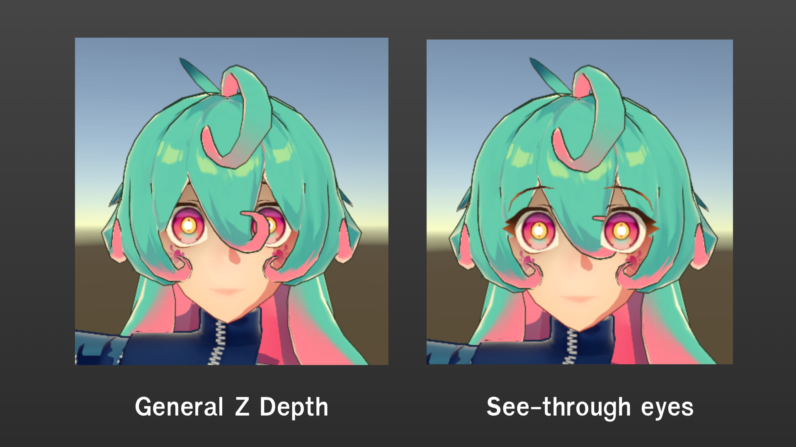
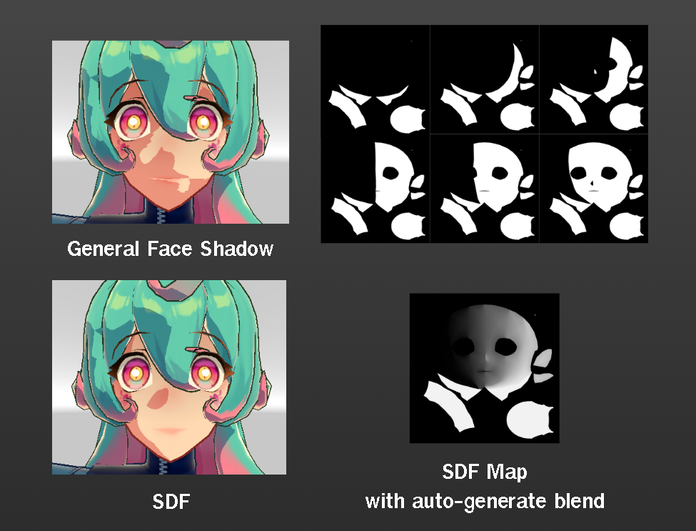
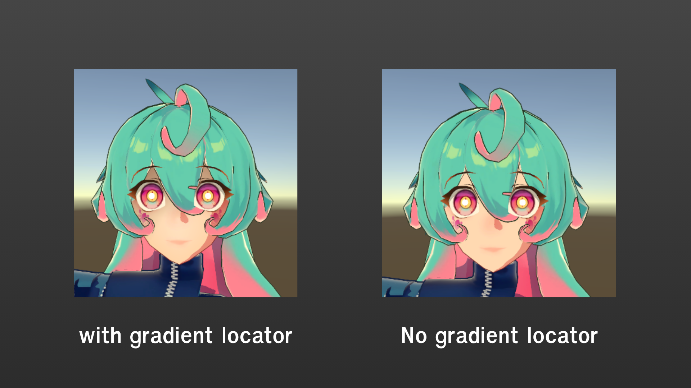
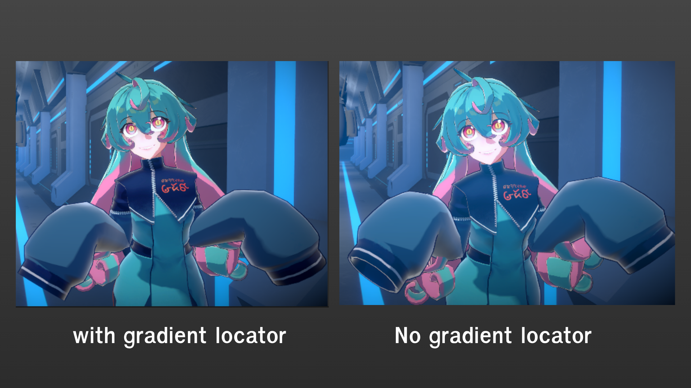

# Character Lookdev Overview

เนื่องจากตัวละครเป็น Render Anime Style เราจึงนำ Unity Toon Shader มาปรับแต่งเพิ่มเติมเป็น Ukore Toon Shader ของเราเอง โดยจะมีเทคนิคที่ใช้หลักๆดังนี้

# 1. See-Through Eyes

ดวงตาเป็นส่วนที่สำคัญ เมื่อทำให้ตาเห็นชัดเจนออกมาได้โดยไม่ถูกผมบัง จะทำให้ Character แสดงสีหน้าได้ชัดเจนยิ้งขึ้น โดยเราจะทำการแยก Stencil ของตาและผมออกจากกัน

---

# 2. เงาบนหน้าแบบ SDF

เนื่องจากเงาจาก normal เดิมจาก Model จริงๆ อาจทำให้หน้าตาดูไม่คลีน แบบ Anime เราจึงต้องใช้ SDF Map หรือการ Baked เงาไว้ล่วงหน้าว่าเมื่อแสงตกกระทบ แต่ละช่วงเงา หน้าตาจะเป็นยังไง

---

# 3. Gradient Mix Locator

เนื่องจากตัวละครหลักจะเป็น Shader ทีเป็น Toonshade ทำให้อาจสูญเสียการไล่ shading แสงเงาแบบปกติและ Fog ของ Unity อาจจะไม่ทำงานโดยตรงดังนั้น เราจะต้องมี Tools ที่สามารถไล่เฉดสีเพื่อมาทดแทนแสง เงา ที่ขาดหายไป ซึ่งสามารถใช้ตั้งแต่ตอน Set-up ตตัวละคร Default ( เช่นเงาหน้าผาก ) หรืออาจจะใช้ตาม Shot ต่างๆเลยก็ได้

---

Preview Lookdev Result ใน Shot จริง (ยังไม่ใช่ Final Look)

<video controls width="100%">
  <source src="../../assets/videos/lookdev-result.mp4" type="video/mp4">
  Your browser does not support the video tag.
</video>