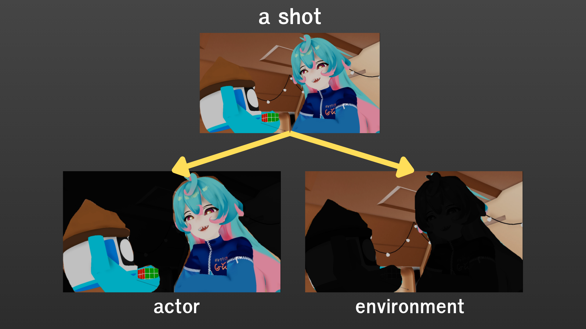
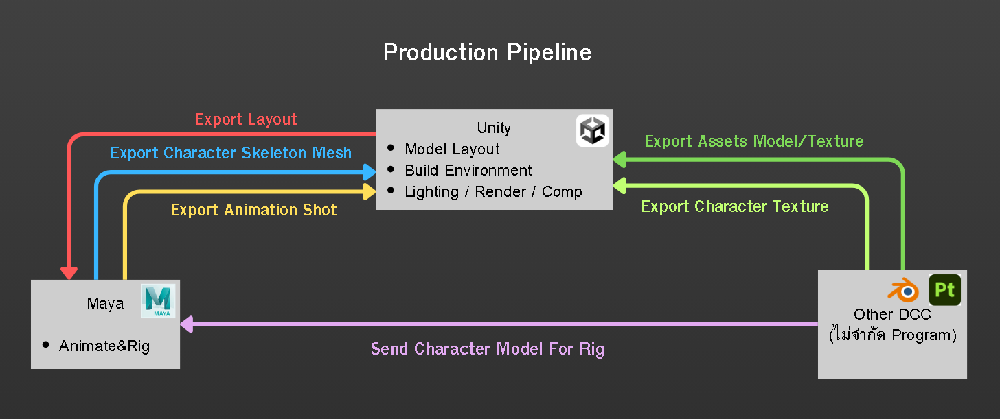

# Pipeline Overview

เนื่องจากโปรเจคนี้เป็น Short Animation ดังนั้นใน Pipeline เราจะ Breakdown ประกอบหลักๆของแต่ละ Shot ออกมาดังนี้

### 1. Actor
เป็น Character หรือ Props ที่มี Animation เช่น Props ที่มีการ Interact กับตัวละคร หรือ Props ที่มี Idle Animation

### 2. Camera
กล้องของ Shot นั้น

### 3. Environment
คือฉากรอบตัวที่จะอยู่นิ่งๆ อาจมีการเคลื่อนไหวเพิ่มเติมได้ แต่จะเกิดจาก Particle Effect เช่นใบไม้ใบหญ้า หรือเอฟเฟคน้ำต่างๆ ที่ Static อยู่เฉยๆ ก็ถือเป็น Env เช่นกัน

 

---

 

# Pipeline Programs

ซึ่งในการทำ Animation โปรเจคนี้เราจะใช้โปรแกรมหลักๆ อยู่ 2 โปรแกรมได้แก่ Maya และ Unity ตามภาพ ส่วนหน้าที่ที่เหลือจะไม่ได้โฟกัส ณ จุดๆนี้

จากในรูปแผนแังเราจะเขียนสรุปออกมาง่ายๆดังนี้

### 1) หน้าที่ของ Unity

**Actor**

- Import Animation ของ Actor ของแต่ละ Shot จาก Maya

- Import Skeleton ของ Actor จาก Maya และนำมา Set-up Textures, Shader ใน Unity

**Environment**
    
- Import Model,Textures ของ Environment จากโปรแกรม DCC ใดๆก็ตาม และ Set-up Materials ใน Unity

โดยเราได้จัดทำ Docuemtn เอาไว้ดังนี้ ศึ่วเป็น Pipeline ในการ Import มาที่ Unity ซึ่งได้แก่

1. Shot Import (Maya Animation) to Unity

2. Actor Set-up (Maya Skeleton Mesh) to Unity

3. Env&Character Assets& Textures (DCC) to Unity

### 2) หน้าที่ของ Maya

**Actor**

- ทำการนำโมเดล Character, Props จากโปรแกรม DCC ใดก็ตาม มา Rig 

- นำริกมาทำ Animation ในแต่ละ Shot

**Environment**

- รับ Layout มาจาก Unity เพื่อให้ Animation ใช้ประกอบฉากในการทำ Animation

- Layout คือ Environment ที่ถูกลดทอนให้ Animator พอเห็นภาพสัดส่วนของฉากคร่าวๆ โดยไม่มี Texture, Model ที่ซับซ้อน เพื่อให้ Animator อนิเมทได้ลื่นไหลที่สุด และ Artist ไม่จำเป็นต้องอัพเดท Texture, Models เพิ่มใน Layout ถ้าไม่จำเป็นจริงๆ

- ส่วน Env เราจะ Build Layout เองใน Unity และ Import Model,Texture จาก DCC ตัวอื่นไม่จำกัดโปรแกรมได้เลย

