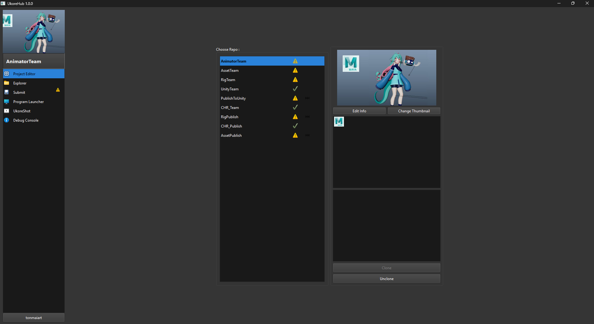
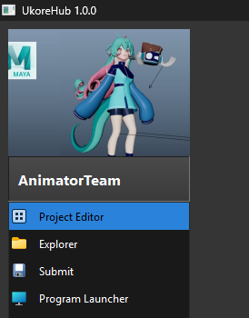
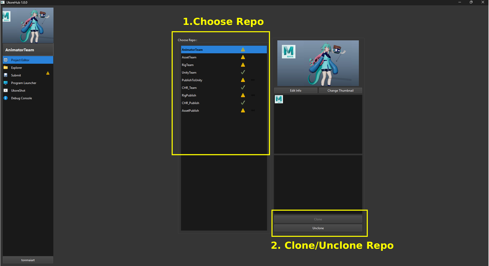
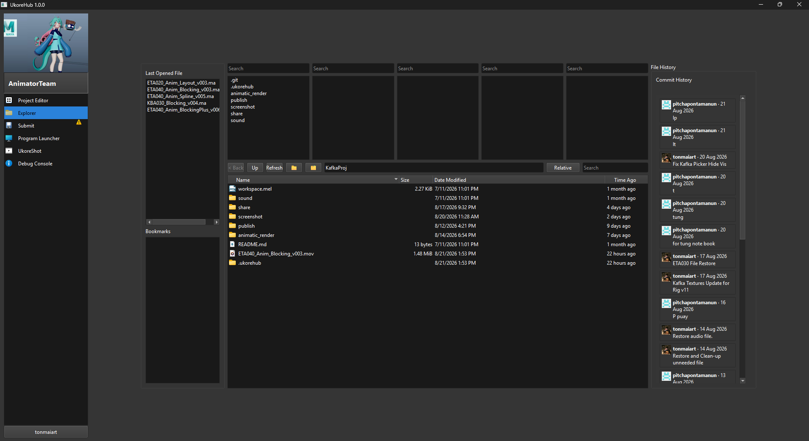
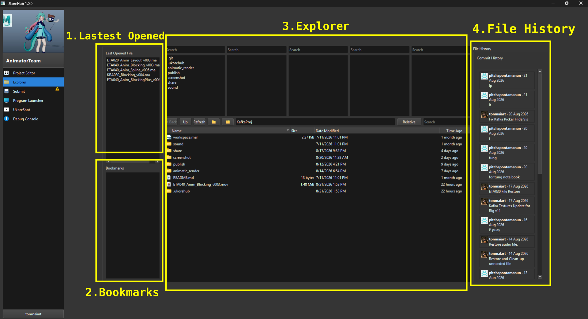
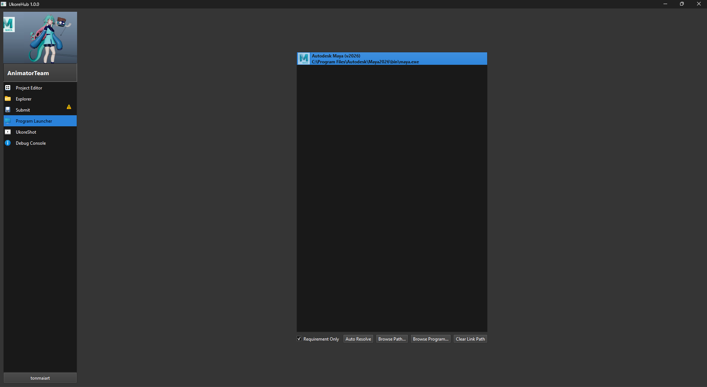

# Ukore Hub

Ukore Hub เป็นโปรแกรมศูนย์กลางที่ Production Artist ทุกคนจะใช้ในการเปิดงาน , แก้ไขงาน และส่งงาน

ซึ่ง Production Artist ทุกคนต้องเปิดโปรแกรม DCC (Digital Content Creation) ต่างๆ เช่น Autodesk Maya , Blender , Unity 
Artist ผ่าน Ukore Hub เท่านั้น เพื่อให้รักษาสภาพแวดล้อมการทำงานของทุกคนเป็นมาตรฐานเดียวกัน และทำให้สามารถใช้ Pipeline Tools ต่างๆได้

 

---

 

### สิ่งที่ต้องเตรียมก่อนใช้งาน Ukore Hub

1. สมัครบัญชี Github ด้วย Email ส่วนตัวได้ที่  [GitHub Website](http://www.github.com/)
2. ดาวน์โหลดและติดตั้งโปรแกรมเหล่านี้ลงในคอมของคุณ ก่อนติดตั้ง Ukore Hub
    - [Download Git](https://github.com/git-for-windows/git/releases/download/v2.55.0.windows.4/Git-2.55.0.4-64-bit.exe)
    - [Download Git LFS](https://github.com/git-lfs/git-lfs/releases/download/v3.7.1/git-lfs-windows-v3.7.1.exe)
    - [Download Python Manager](https://www.python.org/ftp/python/pymanager/python-manager-26.3.msix)

 

---

 

### การติดตั้ง Ukore Hub

1. [ดาวน์โหลด Ukore Hub](https://github.com/tonmaiart/UkoreHubLauncher/archive/refs/heads/main.zip)
2. ทำการแตกไฟล์ Extract .zip ไว้ที่ไหนก็ได้บนเครื่อง แล้วเปิดไฟล์ UkoreHubLauncher.exe 
3. โปรแกรมจะขึ้นหน้าต่างให้ Login github ผ่านเบราว์เซอร์ และนำโค้ดจากโปรแกรมไปกรอกใส่เพื่อยืนยันการ Login
4. รอโปรแกรม Update สักครู่แล้วหน้าต่าง UkoreHub พอ Update เสร็จมันจะเปิดหน้าต่างขึ้นมาเอง

 

---

 

### การเลือก Repositories ที่จะทำงาน
1. เมื่อ Ukore Hub เปิดหน้าต่างขึ้นมา ให้กดเลือก Tab Project Editor ทางซ้ายมือ
2. จะมีรายการ Repositories ให้เลือก ตรงนี้ให้สอบถามข้อมูลแต่ละแผนกว่าแผนกนั้นต้องใช้ Repositories ไหน
3. กดเลือก Repostories นั้นแล้วกด Clone 
4. ไปที่ Tab Submit แล้วรอจนกว่าสถานะการ Clone ด้านล่างซ้ายมือจะครบ 100% เป็นอันเสร็จสิ้น

**หมายเหตุ :** บาง Repositories อาจถูกจำกัดสิทธิ์ให้เข้าถึงได้บาง User เท่านั้น สามารถติดต่อแผนก Pipeline เพื่อสอบถามสิทธิ์เพิ่มเติม
การแก้ไขไฟล์และส่งไฟล์

 

---

 

# การใช้งาน Tab ต่างๆของ Ukore Hub

Artist ควรศึกษาการใช้โปรแกรมนี้ให้เข้าใจ เพื่อเรียนรู้วิธีการส่งงาน , Sync Other Commit , เปิดโปรแกรม อย่างถูกต้อง เพื่อไม่ให้เกิดข้อผิดพลาดที่อาจจะส่งผลกับไฟล์งานในอนาคต โดยเราจะมี Tab หลักๆ 4 ส่วนดังนี้

# 1) Project Editor

เป็นหน้าสำหรับเลือก Repositories ที่เราจะทำงาน โดยแต่ละ Repositories ก็จะแบ่งแยกไปตามลักษณะงาน เช่น Animator ก็จะทำงานใน Repo ที่ชื่อ AnimatorTeam , ฝ่าย Assets ก็จะทำงานใน Repo ที่ชื่อ AssetTeam เป็นต้น

โดยส่วนประกอบต่างๆ จะมีดังนี้

### 1. Choose Repo

แสดงรายการ Repositores ที่เราต้องการจะทำงาน ให้เราเลือก

### 2. ปุ่ม Clone/ Unclone

1. กด Clone จะเป็นการดึงข้อมูลไฟล์ทั้งหมดของ Repositorie นั้นลงมาบนเครื่อง ให้กดเมื่อต้องการจะทำงานใน Repo นั้นครั้งแรก ครั้งเดียว

2. กด Unclone จะเป็นการลบข้อมูลของ Repositorie นั้นออกจากเครื่อง ให้กดเมื่อโปรเจคสิ้นสุดลง หรือไม่ได้ทำงานใน Repo นั้นอีก

**หมายเหตุ :**

1. การ Clone บาง Repo อาจจะมีการพึ่งพา Repo ตัวอื่นๆ ซึ่งจะขึ้นเป็น Dialogue แจ้งเตือน ให้ผู้ใช้กด Confirm ได้เลย
2. หากจะกด Unclone ให้เช็คใน Submit Tab ว่างานที่แก้ไขไว้ถูกส่งงาน Commit ขึ้นไปเรียบร้อยแล้ว ไม่เช่นนั้นจะสูญเสียการแก้ไขชิ้นงานนั้นทั้งหมด

# 2 ) Explorer

Explorer Tab เป็นส่วนที่ Artist ใช้ในการจัดการไฟล์, เปิดไฟล์งานต่างๆใน Repositories 

โดยจะมีส่วนประกอบต่างๆดังนี้

1. Lastest Opened : แสดงไฟล์ที่เปิดล่าสุด

2. Bookmarks : แสดงไฟล์ , folder ที่ถูก Bookmarks ไว้

3. Explorer : เป็น Expolorer สำหรับเปิดไฟล์งานต่างๆ ของ Repositories นี้

4. File History : บอกประวัติของไฟล์ที่เลือก

# 3 ) Submit

เป็น Tab ที่ใช้จัดการการ Sync ไฟล์งาน และส่งงาน โดยจะมีส่วนประกอบต่างๆดังนี้

### 1.Commit History

เป็นส่วนที่แสดงรายการ Commit ของทุกคน โดยจะแบ่งออกเป็นสองรายการได้แก่

1. Recent Commit (Not Sync) : Commit อันใหม่จากเพื่อนร่วมงานที่ยังไม่ถูก Sync บนเครื่องเรา

2. Local Commit : ประวัติการ Commit ที่อยู่บนเครื่องเรา

**หมายเหตุ :** หากมี Recent Commit อัพเดทเข้ามาใหม่ ผู้ใช้ต้องกดปุ่ม Sync New commit เพื่อดึงข้อมูลการเปลี่ยนแปลงจาก Recent Commit มายัง Local Commit เพื่อให้ข้อมูลในเครื่องเราเป็นข้อมูลล่าสุดเสมอ

### 2.Submit New Commit

เป็นส่วนที่เอาไว้ใช้ส่งงาน หรือสร้าง Commit ใหม่โดยจะประกอบไปด้วย

1. รายการด้านบนจะแสดงไฟล์ต่างๆ ที่เราไปเพิ่ม ลบ หรือแก้ไขไว้ 
2. รายการด้านล่างจะแสดงไฟล์ที่เราเอาใส่ตระกร้า เพื่อที่จะ Submit ไฟล์นั้นให้เป็น Commit ใหม่ ให้คนอื่นต่อไป

โดยเราสามารถเลือกรายการแล้วกดปุ่ม Unstage, Stage เพื่อย้ายรายการที่เลือก จากล่างขึ้นบน หรือบนลงล่างได้ตามใจชอบ
จากนั้นให้กด Submit โปรแกรมจะขึ้นให้กรอก Commit Message ให้ระบุข้อความประกอบการส่งงานแล้วกด Submit ได้เลย

**หมายเหตุ :**

1. หากต้องการคืนค่าไฟล์ให้กลับมาเป็นค่าเดิมทุกประการ เหมือนไม่เคยแก้ไขมาก่อน ให้เลือกรายการในรายการด้านบนแล้วกดปุ่ม Revert (โปรดตรวจสอบให้มั่นใจก่อนกดว่าไฟล์นั้นจะไม่กระทบไฟล์งานของเราจริงๆ)

2. การกด submit จะทำการ sync และส่งงานอัตโนมัติ ดังนั้นผู้ใช้ไม่จำเป็นต้องกด Sync อีกรอบหลังส่งงาน

# ข้อควรระวัง
1. ห้ามแก้ไขงานไฟล์เดียวกัน ควรตกลงกับเพื่อนร่วมทีมให้เรียบร้อยว่าใครจะทำงานไฟล์ไหน
2. จากข้อแรก หากต้องส่งต่องานร่วมกัน หรือป้องกันการ Conflict ( การที่ไฟล์นั้นมีคนส่งงานชนกัน ) ให้แก้ด้วยการหมั่น Commit
3. งานทุกครั้งหลังแก้ไขงานทันทีเพื่ออัพเดทให้ไฟล์เราเป็นไฟล์ล่าสุดเสมอก่อนมีใครจะหยิบไฟล์เราไปแก้ไขต่อ

# 4 ) Program Launcher

เอาไว้เปิด Program DCC ที่จะทำงาน โดยแต่ละ Project จะมี Program ที่แสดงตรงนี้แตกต่างกันออกไปแล้วแต่ละ Repositories

- Auto Resolve : ทำการเชื่อมต่อกับโปรแกรมที่มีอยู่แล้วในเครื่องอัติโนมัติ
- Edit : ตั้งค่าการเชื่อมต่อโปรแกรมที่เลือก