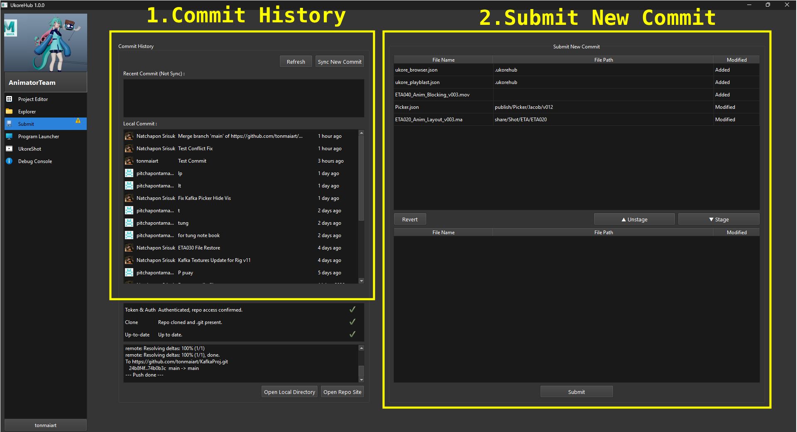

Commit History
แสดงรายการ Commit ของทุกคน โดยจะแบ่งออกเป็นรายการของเครื่องเรา local commit

หากมีการ commit จากผู้ใช้งานคนอื่น จะมีรายการปรากฎเพิ่มขึ้นมาใน Recent Commit

หมายเหตุ : ระบบจะไม่ทำการ Sync ให้ทันที ดังนั้นผู้ใช้ต้องกดปุ่ม Sync new commit เพื่อดึงข้อมูลการเปลี่ยนแปลงล่าสุดมาที่เครื่องของเรา

Submit New Commit
รายการด้านบนจะแสดงไฟล์ต่างๆ ที่เราไปเพิ่ม ลบ หรือแก้ไขไว้ 
รายการด้านล่างจะแสดงไฟล์ที่เราเอาใส่ตระกร้า เพื่อที่จะ Submit ไฟล์นั้นให้เป็น Commit ใหม่ ให้คนอื่นต่อไป
หมายเหตุ :
กดปุ่มเลือกรายการแล้วกด Stage,Unstage เพื่อเลือกว่าจะเอาไฟล์ไหนขึ้น commit
สามารถเลือกไฟล์แล้วกด Revert ได้หากต้องการคืนค่าไฟล์นั้น หากไม่ได้ตั้งใจแก้ไข (หากกด revert file นั้นแล้วจะไม่สามารถกูคืนได้อีก)
- การกด submit จะทำการ sync และส่งงานอัติโนมัติ