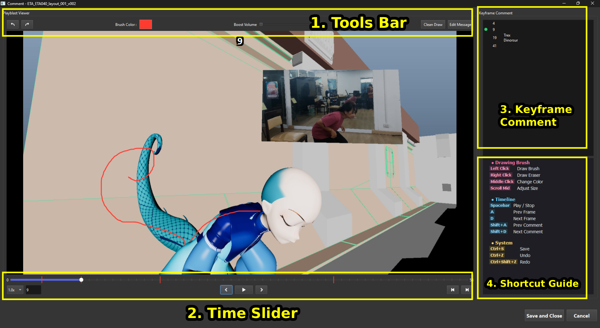

# Ukore Shot Comment Editor

ใช้ Comment แต่ละคีย์เฟรมของ Playblast สามารถวาดเส้นและใส่ Comment แต่ละเฟรมได้

# 1. Tools Bar
- ปุ่ม Undo (Ctrl+Z) , Redo (Ctrl + Shift + Z)
- Brush Color : ใช้เปลี่ยนสี Brush (Middle Click)
- ปุ่ม Clean Draw : ลบการวาดทั้งหมดในเฟรมปัจุบัน
- ปุ่ม Edit Message : ทำการแก้ไข Message Comment ของ เฟรมปัจจุบัน
- กดคลิกซ้ายบนหน้าจอเพื่อวาด , คลิกขวาค้างตรงเส้นที่เคยวาดไปแล้วเพื่อลบ

# 2. Time Slider
เครื่องมือจากซ้ายมือไปขวามือสุดประกอบด้วย
- Speed : เอาไว้ปรับความไวให้หน่วงเวลาลง
- Keyframe : ช่องแสดง Keyframe ปัจุบัน
- ปุ่ม Prev Keyframe (A) , Next Keyframe (D)
- ปุ่ม Play/Stop (Spacebar)
- ปุ่ม Prev commented keyframe (Shift+A) , Next commented keyframe (Shift+D)

# 3.Keyframe Comment
- แสดงรายการ Keyframe ทั้งหมด ที่เคย Comment ไปแล้ว ไม่ว่าจะเคยวาด หรือ Edit Message ไว้ก็จะแสดงตรงนี้

# 4.Shortcut Guide
- แสดง Shortcut ทั้งงหมด