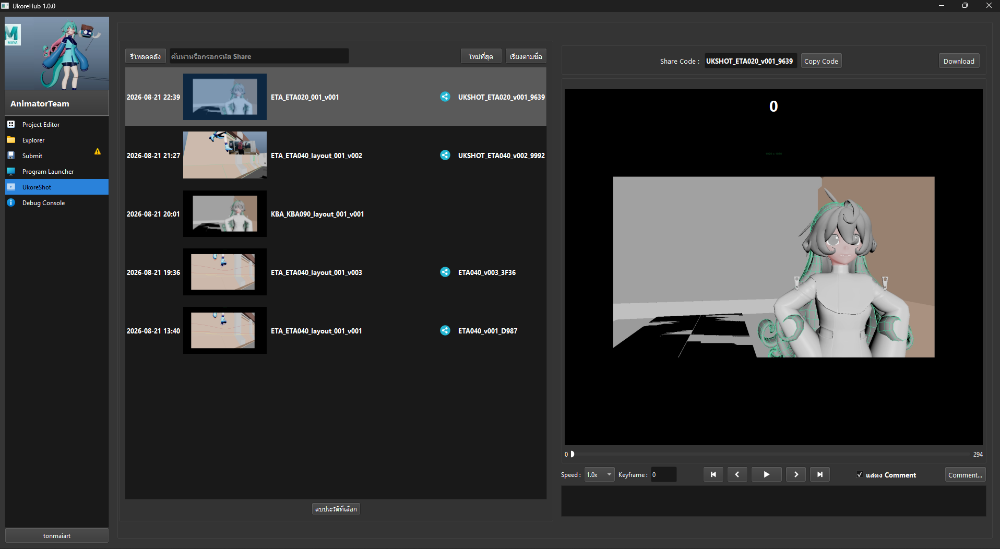
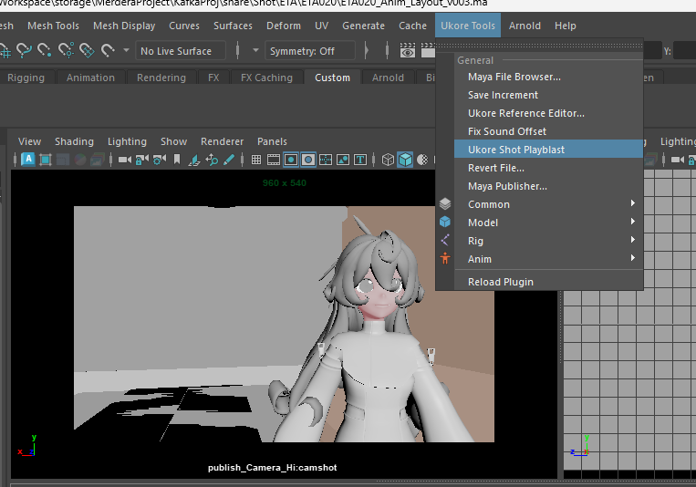

# Ukore Shot

Ukore Shot จะทำงานควบคู่กับ Ukore Shot Playblast ของ Maya

ใน Maya แถบ Ukore Tools จะมีปุ่ม Ukore Shot Playblast เมื่อกด Maya จะ playblast กล้องปัจุบัน โดยเราสามารถเช็คประวัติการ playblast ทั้งหมดได้ที่ Tab Ukore Shot ใน Ukore Hub นั่น้อง

ฝั่งซ้ายมิอจะแสดงรายการ Playblast ทั้งหมด โดย Playblast จะแบ่งเป็นสองแบบคือ Playblast จากเครื่องของเรา (เราเห็นและแก้ไขคอมเมนต์ได้เพ่ยงคนเดียว)
และ Playblast ที่เปิดแชร์ (คนอื่นสามารถเห็นและแก้ไข Comment ได้) 
โดยสามารถสังเกตุที่ icon share ท่านชื่อ

โดยคุณสามารถดูวิธีการแชร์วิดีโอได้ที่

เราวามารถเล่นวิดีโอ Previee ทางขวามือได้ โดยสามารถกดปุ่ใม shortcut ได้ดังนี้
Spacebar-เล่น/หยุด
A,D - เลื่อนเฟรมไปทางซ้ายขวา
Shift A,Shift D - ไปย้งเฟรม comment ก่อนหลัง

โดยเราสามารถคอมเมนต์วิดีโอได้ด้วยการกด comment สามารถอ่ายต่อได้ที่ การ Comment Editor

คุณยังสามารถลบรายการได้ทางซ้ายมือ