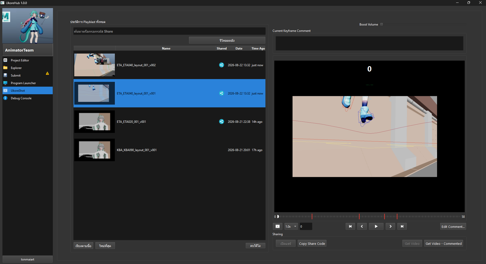

# Ukore Shot

Ukore Shot เป็น Plug-in เสริมของ Ukore Hub ซึ่งจะปรากฎให้ใช้งานในบาง Repo เช่นแผนก Animator

โดย Ukore Shot เป็น Plug-in ที่ช่วยให้ Animator สามารถกด Playblast จาก Maya และสามารถเปิดดู , วาดเส้น Comment แต่ละ Keyframe และสามารถแชร์ให้คนอื่นๆในแผนกได้อย่างง่ายดาย

---

## ส่วนประกอบต่างของโปรแกรม

### 1. Playblast History

แสดงรายการ Playblast ทั้งหมด โดย Playblast จะแบ่งเป็นสองแบบคือ Playblast จากเครื่องของเรา (เราเห็นและแก้ไขคอมเมนต์ได้เพ่ยงคนเดียว)
และ Playblast ที่เปิดแชร์ (คนอื่นสามารถเห็นและแก้ไข Comment ได้)

ช่องค้นหา : สามารถใช้ค้นหาชื่อ Shot หรือกรอก Share Code ของคนอื่นแล้วกด Enter เพื่อโหลดรายการ Playblast ของคนอื่นขึ้นมาได้
ปุ่มลบวิดีโอด้านล่าง : เลือกรายการ Playblast แล้วกดลบได้ 

**หมายเหตุ:** สามารถแยกแยะ Playblast ที่แชร์กับ Playblast บนเครื่องด้วยการ สังเกตุที่ icon share สีฟ้าในรายการ

### 2. Share Code

จะเป็นพื้นที่แสดงรหัส Share Code โดยเราสามารถ Copy Code แล้วส่งต่อให้คนอื่นได้ 

**หมายเหตุ :** ต้องกดเปิดแชร์ก่อนในครั้งแรก หากวิดีโอนั้นไม่เคยเปิดแชร์มาก่อน

### 3. Playblast Viewer

เราสามารถเล่นวิดีโอ Preview ทางขวามือได้ โดยสามารถกดปุ่ม shortcut ได้ดังนี้

**- Spacebar** - เล่น/หยุด

**- A, D** - เลื่อนเฟรมไปทางซ้ายขวา

**- Shift A, Shift D** - ไปย้งเฟรม comment ก่อนหลัง

Ukore Shot จะทำงานควบคู่กับ Ukore Shot Playblast ของ Maya

ใน Maya แถบ Ukore Tools จะมีปุ่ม Ukore Shot Playblast เมื่อกด Maya จะ playblast กล้องปัจุบัน โดยเราสามารถเช็คประวัติการ playblast ทั้งหมดได้ที่ Tab Ukore Shot ใน Ukore Hub นั่น้อง

โดยเราสามารถคอมเมนต์วิดีโอได้ด้วยการกด comment สามารถอ่ายต่อได้ที่ การ Comment Editor

---

### การ Playblast ฝั่ง Maya

วิธีการ Playblast ใน maya เพื่อส่งไป Ukore Shot Tab
ต้องกดผ่าน **Ukore Tools > Ukore Shot Playblast**

# Ukore Shot Comment Editor

ใช้ Comment แต่ละคีย์เฟรมของ Playblast สามารถวาดเส้นและใส่ Comment แต่ละเฟรมได้

# 1. Tools Bar
- ปุ่ม Undo (Ctrl+Z) , Redo (Ctrl + Shift + Z)
- Brush Color : ใช้เปลี่ยนสี Brush (Middle Click)
- ปุ่ม Clean Draw : ลบการวาดทั้งหมดในเฟรมปัจุบัน
- ปุ่ม Edit Message : ทำการแก้ไข Message Comment ของ เฟรมปัจจุบัน
- กดคลิกซ้ายบนหน้าจอเพื่อวาด , คลิกขวาค้างตรงเส้นที่เคยวาดไปแล้วเพื่อลบ

# 2. Time Slider
เครื่องมือจากซ้ายมือไปขวามือสุดประกอบด้วย
- Speed : เอาไว้ปรับความไวให้หน่วงเวลาลง
- Keyframe : ช่องแสดง Keyframe ปัจุบัน
- ปุ่ม Prev Keyframe (A) , Next Keyframe (D)
- ปุ่ม Play/Stop (Spacebar)
- ปุ่ม Prev commented keyframe (Shift+A) , Next commented keyframe (Shift+D)

# 3.Keyframe Comment
- แสดงรายการ Keyframe ทั้งหมด ที่เคย Comment ไปแล้ว ไม่ว่าจะเคยวาด หรือ Edit Message ไว้ก็จะแสดงตรงนี้

# 4.Shortcut Guide
- แสดง Shortcut ทั้งงหมด