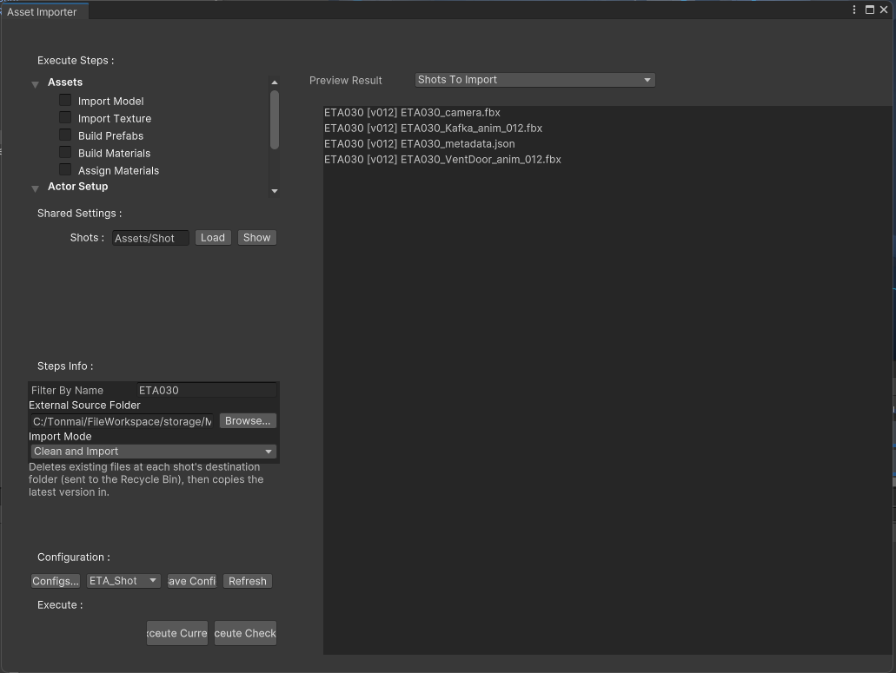
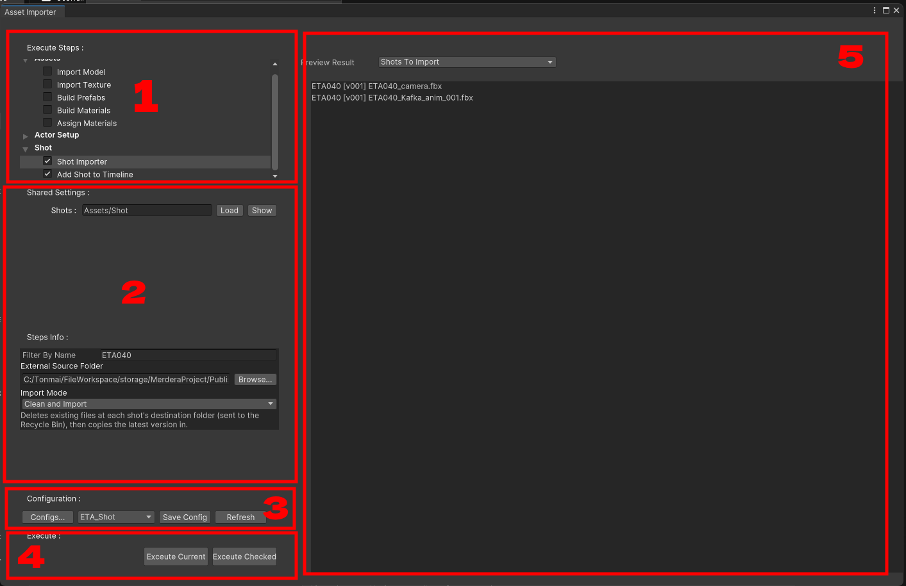

#Ukore Asset Importer 

เป็น Tools ที่สร้างออกแบบมาเพื่อรวมรวม Operation ทุกอย่างในการ Import , Build , Set-up Assets , Shot ต่างๆ ครบจบในที่เดียว โดยส่วนใหญ่จะ Detect การตรวจหาความหมายต่างๆ ผ่าน Naming Convention ของไฟล์ และ Sub Directories ของโฟลเดอร์ที่ Import ว่าสอดคล้องกับ Hierarchy ที่ระบบต้องการหรือไม่

# องค์ประกอบต่าง

โดยจะแบ่งพาร์ทต่างๆ และความหมายของแต่ละพาร์ทได้ดังนี้

### 1. Execute Steps
เป็น Step ที่เราต้องการจะรัน ซึ่งจะถือแบ่งเป็นหมวดหมู่ Assets, Actor Set-up , Shot ซึ่งเราสามารถกด Check Enable เฉพาะ Step ที่เราต้องการได้

### 2. Step Settings
เอาไว้ตั้งค่า Setting ของ Step นั้นๆ เช่น Import Path , Import Behaviour 

### 3. Configuration
เอาไว้จัดการ Preset ที่เราเคยสร้างเอาไว้ เพราะแต่ละ Sequence Shot Import ก็จะเป็น Config ที่แตกต่างกันออกไป

### 4. Execute Steps
สามารถเลือกได้ว่าจะรัน Step ที่เลือกปัจุบัน หรือรันตาม Order ทั้งหมดที่ติ้ก Checked เอาไว้

### 5. Preview Result
เอาไว้ Preview ผลลัพธ์ของแต่ละ Steps ว่า Detect Naming Convention อะไรเจอบ้าง อะไร Valid, Invalid สำหรับ Steps นั้นก็จะแสดงตรงนี้
