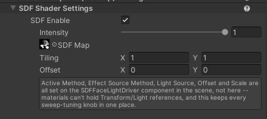
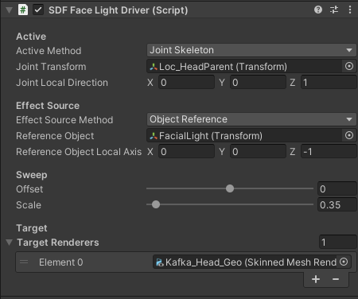
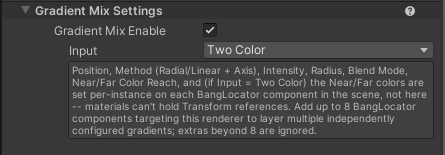
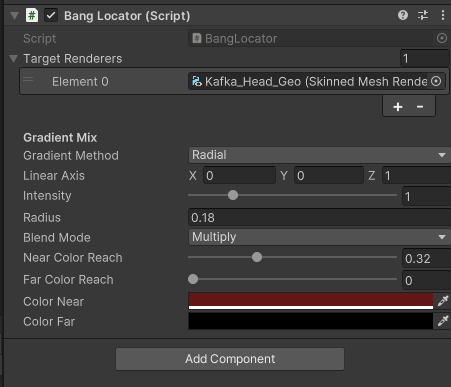

# Unity Ukore Toonshader

เป็น Custom Shader ที่จะใช้ Anime Character โดยเฉพาะ ซึ่งเกิดจากการนำ [Unity Toon Shader](https://docs.unity3d.com/Packages/com.unity.toonshader@0.6/manual/index.html) มา Modified เพิ่มเติมฟีเจอร์ใหม่ได้แก่ SDF , Gradient Mix โดย[ดู Result การใช้ Gradient Mix, SDF ได้ที่นี่](../merdera-project/lookdev.md)

# 1. SDF
### 1.1) SDF Shader Settings (อยู่ใน Ukore Toon Shader Material)

เป็นระบบที่ทำให้เราเพิ่ม SDF Map เข้าไปได้ โดยปกติจะใช้กับใบหน้าตัวละคร เป็นการ Fixed Shadow ของ ใบหน้า โดยอิงจากทิศทางของ Source ที่ต้องการ ซึ่งอาจจะเป็น Directional Light หรือ Custom Object ใดๆก็ได้

### 1.2) SDF Face Light Driver

ต้อง Assign Component นี้ให้ Object ใดก็ได้ใน Scene เพื่อ Setting Vector ดังนี้

- Active Source : Vector ที่จะใช้กำหนดทิศทางของแสง (ส่วนใหญ่จะใช้ Directional Light)

- Effect Source : Vector ที่จะเป็นตัวอ้างอิง (ซึ่งส่วนใหญ่จะใช้ Joint head ของตัวละคร)

# 2. Custom Gradient 

### 2.1) Gradient Mix Settings (อยู่ใน Ukore Toon Shader Material)

เป็นส่วนที่ใช้สร้าง gradient ตาม coordinate ของ world position โดย gradient จะยิงออกมาเป็น Radial หรือ Linear ก็ได้ ซึ่งจะอ้างอิงจากตำแหน่ง World Coordinate ของ Object ที่ทำการ Assign Bang Locator ไว้ใน Scene

### 2.2) Bang Locator

BangHair Locator Component (ตัวที่จะสร้างใน Transform ใดก็ได้ ที่ต้องการกำหนดข้อมูลทั้งหมดของ Gradient เช่นตำแหน่ง , Gradient Color , Intenisty )

โดยปกติเราจะสร้าง Locator Gradient ใส่เข้าไปใน Prefabs ของ Set-up Character เลยเพื่อทำ Shadow bang หรือเอฟเฟคแก้มแดง หรือใดๆก็ตาม

หมายเหตุ : จำกัดเอฟเฟคของ Bang Locator 8 ตัว ต่อ 1 Material
